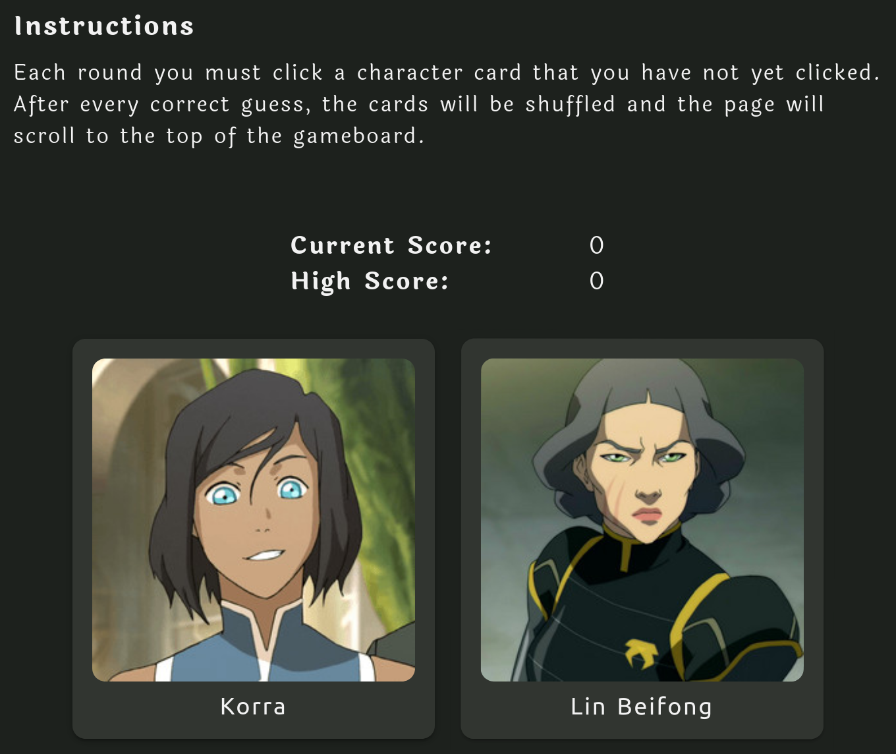

# Memory-bender

## Description

"Long ago, the cards lived together in harmony. Then, everything changed when the memory game was created. Only you, master of memory, can defeat it."

Test how good your memory is with this memory card game, featuring characters from the animated television shows [Avatar: The Last Airbender](https://en.wikipedia.org/wiki/Avatar:_The_Last_Airbender) and [The Legend of Korra](https://en.wikipedia.org/wiki/The_Legend_of_Korra).

Credit for all of the images used in this project goes to [The Avatar Wiki](https://avatar.fandom.com/wiki/Avatar_Wiki).

### Features

- Built using React functional components and hooks.
- Theme toggle to play either with a dark theme (default) or a light theme.
- Keeps track of your personal high score for each session (resets when you revisit the page).

### How-To

The goal of the game is to remember which cards you have already clicked on, and to click on the cards that you have not yet clicked. Simple in concept, but is it as simple to win the game?

### Issues During Creation/Misc. Notes

For this project, the biggest difficulty was getting the aria-live regions to work how I wanted, partially due to not planning out the placement of components as well as I could have for it. This issue, however, will help me work better on implementing aria-live regions in React projects, especially those that utilize routing.
